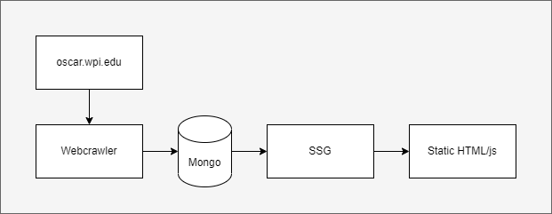

<h1 align="center">GEORGE</h1>

<i>Gompei's Eternal hub for Online Reports, Grades, Et cetera</i>

# Introduction

GEORGE - _Gompei's Eternal hub for Online Reports, Grades, Et cetera_ - is a recreation of [OSCAR](https://oscar.wpi.edu/), a tool for browsing WPI student course reports. OSCAR is powerful and widely used, but it lacks real analytics and the site is kind of shit to navigate. GEORGE has an informative and accessible UI, as well as additional analytics and options.

**GEORGE exists because WPI students' access to course report data should not be limited in any way by a professor.**

# How it Works

GEORGE is basically a static site whose build system consists of the following steps:

1. A crawler scrapes all relevant info from oscar.wpi.edu. This includes both DOM elements from the site HTML and calls to the OSCAR API.
2. This data is restructured and stored in a MongoDB database.
3. The GEORGE frontend is generated from React code using [Next.js static site generation (SSG)](https://nextjs.org/docs/basic-features/data-fetching/get-static-props)

<i>Figure 1: GEORGE build pipeline</i>

Notice that since the site is 100% statically generated, there is no API for loading course report data. If you are interested in getting access to this data, email me.

# Why use Mongo?

In the build process for GEORGE, Mongo is basically just a temporary store. The data is collected once, used once, and then it doesn't really do anything. However, Mongo is still useful for a few reasons

1. MQL operations made restructuring the data from OSCAR extremely straightforward.
2. Because the database has a lot of interdependent objects, Mongo makes queries much faster. Even though query speed isn't really a concern since it's a one-time-cost, it made it nicer for me when developing.
3. I am interested in doing more analysis on the data from outside the GEORGE site, and it's nice to have data on hand.
4. In case anyone else wants to use this data, I can easily share it.
